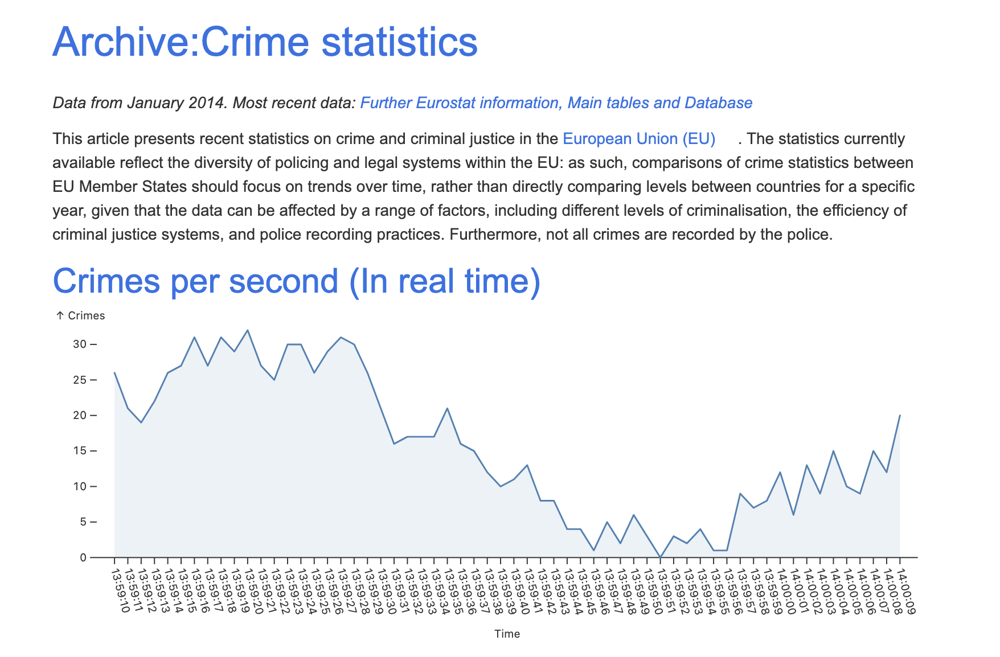

<!-- ABOUT THE PROJECT -->
# data visualisation

A page that documents crime statistics in Europe

[View project live](https://louis-va.github.io/js-datavisualisation-challenge/)

## Description



I worked on this project in october 2023 with the goal of improving my understanding of Javascript and more specifically on using libraries, manipulating the DOM and using the fetch API.

It is an exercise which is part of the Becode bootcamp. The goal was to retrieve data from the DOM and reinject it with multiple graphs.


## Built With

* Vite
* ESLint
* Prettier
* [Observable Plot](https://observablehq.com/plot/what-is-plot)


<!-- GETTING STARTED -->
# Getting Started

## Prerequisites

You need to have node and npm installed on your machine to run this project locally.  

### npm
  ```sh
  npm install npm@latest -g
  ```

## Installation

### 1. Clone the repo
```sh
git clone https://github.com/your_username_/Project-Name.git
```
### 2. Install NPM packages
```sh
npm install
```

## Execution 
```sh
npm run dev
```